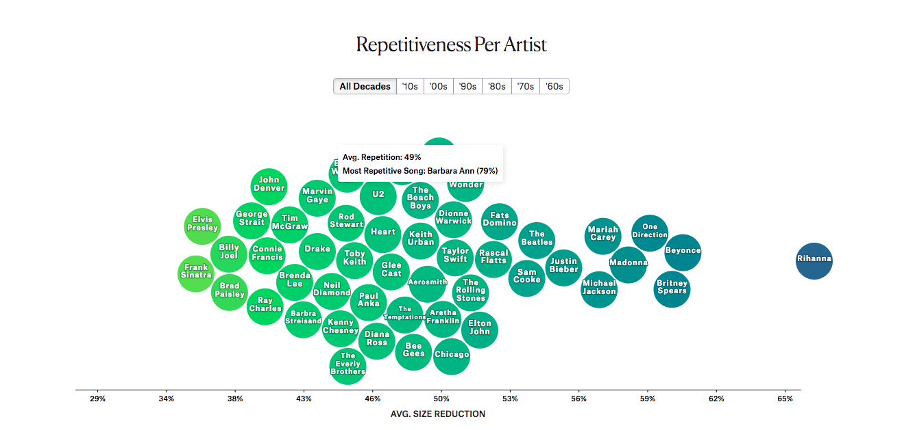
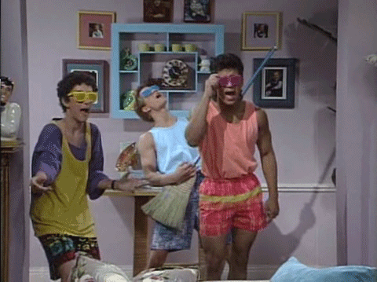
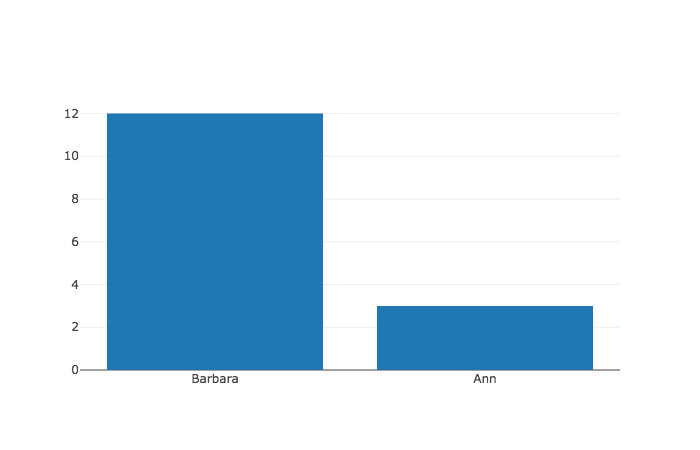
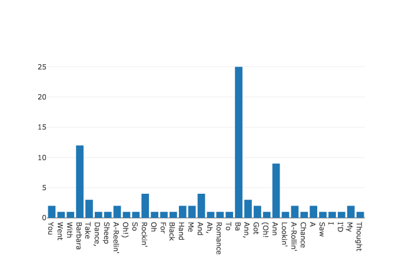

# Instant Data Science

When starting any course, you likely look at the syllabus to see what's covered and answer can you do it.  In this lesson, we'll hope to give you a sense of how with just a little bit of knowledge you can make some real progress in using programs to answer questions with data.  

To do so, we'll have lessons and labs on the following topics: 
* Data types: working with text and data 
* Variables: storing data
* Lists: working with data in an ordered collection
* Dictionaries: representing data as a collection of attributes   
* Loops and iteration: repeating a sequence of instructions  
* Data visualization: using plots to display data
* Functions: defining and running specific procedures in code 

So this set of lessons will go into these topics, with lessons and labs on each. Then, we will break down the content down step by step.  But this lesson is about instant data science.  So explore that in these first topics.

### Song Analysis

What makes a hit record?  Does repetitiveness help?  And is our music getting more repetitive over time?  Questions like these were asked by the great computer scientist Donald Knuth in 1977, and were reasked and answered, by Colin Morris in [this article](https://pudding.cool/2017/05/song-repetition/).

Here is a chart that Colin Morris produced showing some of the most repetitive popular artists.  How was something like this made and calculated?



### Analyzing one song

Let's take the song Barbara Ann, the most repetitive song of the Beach Boys, and remastered by the cast of Saved by the Bell in 1990.  



How did the cast learn all of the words so easily?  Repetition. Here are the some of the lyrics.

    Ah, ba ba ba ba Barbara Ann
    Ba ba ba ba Barbara Ann

    Oh Barbara Ann, take my hand
    Barbara Ann
    You got me rockin' and a-rollin'
    Rockin' and a-reelin'
    Barbara Ann ba ba
    Ba Barbara Ann

    Went to a dance, lookin' for romance
    Saw Barbara Ann, so I thought I'd take a chance
    With Barbara Ann, Barbara Ann
    Take my hand
    You got me rockin' and a-rollin'
    (Oh! Oh!)
    Rockin' and a-reelin'
    Barbara Ann ba ba
    Ba ba ba ba black sheep

    Ba ba ba ba Barbara Ann
    Ba ba ba ba Barbara Ann

It keeps going, but you get the point.  Now let's say that we wanted to count up how many times each word in the above selection appears.  Without a computer, we could do the following: 

* Place each of the words on a separate index card
* Mark a region for a pile of each unique word
* Then, go list of index cards one by one
* And for each index card, find it's pile and increase the size of it's related pile by one


Let's call these steps above **our plan**.  Now that we have a plan, let's translate this into code.

### Strings and Variables

To solve this problem with code, we do something similar.  We start with our words in a **string**, which is a data structure that just represents text.  This is how it looks.


```python
"Ah, ba ba ba ba Barbara Ann Ba ba ba ba Barbara Ann Oh Barbara Ann, take my hand Barbara Ann You got me rockin' and a-rollin' Rockin' and a-reelin' Barbara Ann ba ba Ba Barbara Ann Went to a dance, lookin' for romance Saw Barbara Ann, so I thought I'd take a chance With Barbara Ann, Barbara Ann Take my hand You got me rockin' and a-rollin' (Oh! Oh!) Rockin' and a-reelin' Barbara Ann ba ba Ba ba ba ba black sheep Ba ba ba ba Barbara Ann Ba ba ba ba Barbara Ann"
```


    "Ah, ba ba ba ba Barbara Ann Ba ba ba ba Barbara Ann Oh Barbara Ann, take my hand Barbara Ann You got me rockin' and a-rollin' Rockin' and a-reelin' Barbara Ann ba ba Ba Barbara Ann Went to a dance, lookin' for romance Saw Barbara Ann, so I thought I'd take a chance With Barbara Ann, Barbara Ann Take my hand You got me rockin' and a-rollin' (Oh! Oh!) Rockin' and a-reelin' Barbara Ann ba ba Ba ba ba ba black sheep Ba ba ba ba Barbara Ann Ba ba ba ba Barbara Ann"


> What you see above in the gray box Python code.  The content in the gray box is the code you type in.  The number to the left is the line number of the code.  Below the gray box is the **output** of running the code.  So the output of creating a string, is just that same string - not very interesting. 

To create a **string** in Python, notice that we place quotes at the start and end of text.  If we don't do this, Python will give us an error.


```python
Ah, ba ba ba ba Barbara Ann Ba ba ba ba Barbara Ann Oh Barbara Ann, take my hand Barbara Ann You got me rockin' and a-rollin' Rockin' and a-reelin' Barbara Ann ba ba Ba Barbara Ann Went to a dance, lookin' for romance Saw Barbara Ann, so I thought I'd take a chance With Barbara Ann, Barbara Ann Take my hand You got me rockin' and a-rollin' (Oh! Oh!) Rockin' and a-reelin' Barbara Ann ba ba Ba ba ba ba black sheep Ba ba ba ba Barbara Ann Ba ba ba ba Barbara Ann
```


      File "<ipython-input-5-5fbb40878925>", line 1
        Ah, ba ba ba ba Barbara Ann Ba ba ba ba Barbara Ann Oh Barbara Ann, take my hand Barbara Ann You got me rockin' and a-rollin' Rockin' and a-reelin' Barbara Ann ba ba Ba Barbara Ann Went to a dance, lookin' for romance Saw Barbara Ann, so I thought I'd take a chance With Barbara Ann, Barbara Ann Take my hand You got me rockin' and a-rollin' (Oh! Oh!) Rockin' and a-reelin' Barbara Ann ba ba Ba ba ba ba black sheep Ba ba ba ba Barbara Ann Ba ba ba ba Barbara Ann
                ^
    SyntaxError: invalid syntax


> So notice the output of the code in the gray box is an error - more interesting.  But let's move on.

Ok, so we need the quotes for a string, but to hold onto this string and reference it later, we assign it to a variable.  


```python
lyrics = "Ah, ba ba ba ba Barbara Ann Ba ba ba ba Barbara Ann Oh Barbara Ann, take my hand Barbara Ann You got me rockin' and a-rollin' Rockin' and a-reelin' Barbara Ann ba ba Ba Barbara Ann Went to a dance, lookin' for romance Saw Barbara Ann, so I thought I'd take a chance With Barbara Ann, Barbara Ann Take my hand You got me rockin' and a-rollin' (Oh! Oh!) Rockin' and a-reelin' Barbara Ann ba ba Ba ba ba ba black sheep Ba ba ba ba Barbara Ann Ba ba ba ba Barbara Ann"
```

Now whenever we type the word `lyrics` into Python we reference our string.


```python
lyrics
```


    "Ah, ba ba ba ba Barbara Ann Ba ba ba ba Barbara Ann Oh Barbara Ann, take my hand Barbara Ann You got me rockin' and a-rollin' Rockin' and a-reelin' Barbara Ann ba ba Ba Barbara Ann Went to a dance, lookin' for romance Saw Barbara Ann, so I thought I'd take a chance With Barbara Ann, Barbara Ann Take my hand You got me rockin' and a-rollin' (Oh! Oh!) Rockin' and a-reelin' Barbara Ann ba ba Ba ba ba ba black sheep Ba ba ba ba Barbara Ann Ba ba ba ba Barbara Ann"


Ok, so strings are great for performing operations on text. For example we can call a method `title` on a string to capitaize the first letter of each word.


```python
lyrics.title()
```


    "Ah, Ba Ba Ba Ba Barbara Ann Ba Ba Ba Ba Barbara Ann Oh Barbara Ann, Take My Hand Barbara Ann You Got Me Rockin' And A-Rollin' Rockin' And A-Reelin' Barbara Ann Ba Ba Ba Barbara Ann Went To A Dance, Lookin' For Romance Saw Barbara Ann, So I Thought I'D Take A Chance With Barbara Ann, Barbara Ann Take My Hand You Got Me Rockin' And A-Rollin' (Oh! Oh!) Rockin' And A-Reelin' Barbara Ann Ba Ba Ba Ba Ba Ba Black Sheep Ba Ba Ba Ba Barbara Ann Ba Ba Ba Ba Barbara Ann"


This is a good change.  Let's store it in a new variable called `titled_lyrics`.


```python
titled_lyrics = lyrics.title()
titled_lyrics
```


    "Ah, Ba Ba Ba Ba Barbara Ann Ba Ba Ba Ba Barbara Ann Oh Barbara Ann, Take My Hand Barbara Ann You Got Me Rockin' And A-Rollin' Rockin' And A-Reelin' Barbara Ann Ba Ba Ba Barbara Ann Went To A Dance, Lookin' For Romance Saw Barbara Ann, So I Thought I'D Take A Chance With Barbara Ann, Barbara Ann Take My Hand You Got Me Rockin' And A-Rollin' (Oh! Oh!) Rockin' And A-Reelin' Barbara Ann Ba Ba Ba Ba Ba Ba Black Sheep Ba Ba Ba Ba Barbara Ann Ba Ba Ba Ba Barbara Ann"


Not bad at all.  Strings are great at manipulating all of our text at once.  However, if you remember **our plan**, the first step was to place each word on a separate index card.  But strings **are not** good at separating our text into individual words.  For that we need a new data structure called a **list**.

### Lists

To separate our string into a individual words, we need to change this continuous string into a list.  Here is how we tell the computer to do this: split the string into a different entity every time you see a space.  Here are those directions in code.


```python
list_of_lyrics = titled_lyrics.split(' ')
```

Ok, let's see what `list_of_lyrics` looks like.  You're about to see a lot of words, so just scroll through them, and we'll meet up afterwards.


```python
list_of_lyrics
```


    ['Ah,',
     'Ba',
     'Ba',
     'Ba',
     'Ba',
     'Barbara',
     'Ann',
     'Ba',
     'Ba',
     'Ba',
     'Ba',
     'Barbara',
     'Ann',
     'Oh',
     'Barbara',
     'Ann,',
     'Take',
     'My',
     'Hand',
     'Barbara',
     'Ann',
     'You',
     'Got',
     'Me',
     "Rockin'",
     'And',
     "A-Rollin'",
     "Rockin'",
     'And',
     "A-Reelin'",
     'Barbara',
     'Ann',
     'Ba',
     'Ba',
     'Ba',
     'Barbara',
     'Ann',
     'Went',
     'To',
     'A',
     'Dance,',
     "Lookin'",
     'For',
     'Romance',
     'Saw',
     'Barbara',
     'Ann,',
     'So',
     'I',
     'Thought',
     "I'D",
     'Take',
     'A',
     'Chance',
     'With',
     'Barbara',
     'Ann,',
     'Barbara',
     'Ann',
     'Take',
     'My',
     'Hand',
     'You',
     'Got',
     'Me',
     "Rockin'",
     'And',
     "A-Rollin'",
     '(Oh!',
     'Oh!)',
     "Rockin'",
     'And',
     "A-Reelin'",
     'Barbara',
     'Ann',
     'Ba',
     'Ba',
     'Ba',
     'Ba',
     'Ba',
     'Ba',
     'Black',
     'Sheep',
     'Ba',
     'Ba',
     'Ba',
     'Ba',
     'Barbara',
     'Ann',
     'Ba',
     'Ba',
     'Ba',
     'Ba',
     'Barbara',
     'Ann']


Ok, so this is a list.  It's an ordered collection, and as you can see we are now treating each word as an individual **entity**.  Each individual entity of a list is called an element.  How many elements are there in this list?


```python
len(list_of_lyrics)
```


    95


Ok, but remember the second step of our plan was to allocate space for each unique word.  So now that we have a list of all words, let's see just the unique words.


```python
unique_words = set(list_of_lyrics)
```


```python
unique_words
```


    {'(Oh!',
     'A',
     "A-Reelin'",
     "A-Rollin'",
     'Ah,',
     'And',
     'Ann',
     'Ann,',
     'Ba',
     'Barbara',
     'Black',
     'Chance',
     'Dance,',
     'For',
     'Got',
     'Hand',
     'I',
     "I'D",
     "Lookin'",
     'Me',
     'My',
     'Oh',
     'Oh!)',
     "Rockin'",
     'Romance',
     'Saw',
     'Sheep',
     'So',
     'Take',
     'Thought',
     'To',
     'Went',
     'With',
     'You'}


Ok, you may have noticed that our unique words is significantly smaller than our total list of words.  How much smaller?


```python
len(unique_words)
```


    34


A lot.

So there's a lot of repetition in `Barbara Ann`.  It's time to keep track of each word and the number of occurrences of each word.

### Using dictionaries

So our ultimate goal is to present our list of repetitions almost as a table, with a word to the left and the number of occurrences to the right.  

| Word        | Count           |
| ------------- |:-------------:|
| Ann     | 2 |
| Barbara     | 3 |
| Ba     | 8 |

In Python, this looks like a dictionary.


```python
word_counts =  {'Ann': 2, 'Barbara': 3, 'Ba': 8}
```

A dictionary is a collection of key value pairs, and we use them to store associated data.  Here, each word is associated with it's count. And we can use the key to access the associated value.


```python
word_counts['Ann']
```


    2


And also use the key to reassign that value.


```python
word_counts['Ann'] = 33
```


```python
word_counts
```


    {'Ann': 33, 'Ba': 8, 'Barbara': 3}


So that's the form we want.  How do we get there?

Well we can start by having creating a dictionary with each key as a separate word, and then set the corresponding value to zero.  Kind of like allocating a region on a table for each of our words.   We do this with the `unique_words` list and the `fromkeys` method.


```python
word_histogram = dict.fromkeys(unique_words, 0)
word_histogram
```


    {'(Oh!': 0,
     'A': 0,
     "A-Reelin'": 0,
     "A-Rollin'": 0,
     'Ah,': 0,
     'And': 0,
     'Ann': 0,
     'Ann,': 0,
     'Ba': 0,
     'Barbara': 0,
     'Black': 0,
     'Chance': 0,
     'Dance,': 0,
     'For': 0,
     'Got': 0,
     'Hand': 0,
     'I': 0,
     "I'D": 0,
     "Lookin'": 0,
     'Me': 0,
     'My': 0,
     'Oh': 0,
     'Oh!)': 0,
     "Rockin'": 0,
     'Romance': 0,
     'Saw': 0,
     'Sheep': 0,
     'So': 0,
     'Take': 0,
     'Thought': 0,
     'To': 0,
     'Went': 0,
     'With': 0,
     'You': 0}


### Loops

Ok, now we have two nice data structures.  A `list_of_lyrics` of all of our words, and a `word_histogram` to keep track of the amount of words.  It seems like we're making good progress.  Let's look again at our plan.

* Place each of the words on a separate index card. 
    * **Complete** as `list_of_lyrics`
* Allocate space for a small pile for each unique word
    * **Complete** as `word_histogram`
* Then, go through the index cards one by one
* And for each index card, increase the size of it's related pile by one


So looking through the steps, all that's left are the last two steps.

In Python to go through elements of a list one by one, we use a for loop.


```python
for number in [1,2,3,4]:
    print(number + 10)
```

    11
    12
    13
    14


Ok, so here we want to go through the elements of our `list_of_lyrics` one by one.  For each word in `list_of_lyrics`, we want to find the related key in the dictionary and increase the value by one.  So now we'll loop through each of our words instead of a list of numbers.  We'll find the related value in the dictionary, and increase it by one.

> **Deep breath** These next lines of code may look like magic.  The lessons that follow will explain them.


```python
word_histogram = dict.fromkeys(unique_words, 0)
for word in list_of_lyrics:
    word_histogram[word]  = word_histogram[word]+ 1 
```

> We said it would be confusing.  Good thing there's more lessons to explain it.  Let's see if it worked.


```python
word_histogram
```


    {'(Oh!': 1,
     'A': 2,
     "A-Reelin'": 2,
     "A-Rollin'": 2,
     'Ah,': 1,
     'And': 4,
     'Ann': 9,
     'Ann,': 3,
     'Ba': 25,
     'Barbara': 12,
     'Black': 1,
     'Chance': 1,
     'Dance,': 1,
     'For': 1,
     'Got': 2,
     'Hand': 2,
     'I': 1,
     "I'D": 1,
     "Lookin'": 1,
     'Me': 2,
     'My': 2,
     'Oh': 1,
     'Oh!)': 1,
     "Rockin'": 4,
     'Romance': 1,
     'Saw': 1,
     'Sheep': 1,
     'So': 1,
     'Take': 3,
     'Thought': 1,
     'To': 1,
     'Went': 1,
     'With': 1,
     'You': 2}


Ok, that's it.  If we want to see how many time 'Rockin' appears, we easily can.


```python
word_histogram["Rockin'"]
```


    4


### Visualizing the data

We've got our answer in code.  The final step is to turn it into a chart.  We'll use a library -- which is a collection of code we get from the Internet that does not come with Python -- called Plotly to make our charts. 

In the first four lines we tell Python to get ready to use this library.  And in the last line we tell Python to plot our `trace`.

The meat of the code, the part that we will be changing, is our `trace`.  Trace points to a dictionary with a key of `x` that points to a list of x_values, and a key of `y` that points to y_values.  And a `type` to indicate that this will be a bar chart.


```python
import plotly
from plotly.offline import iplot, init_notebook_mode
from plotly import tools
import plotly.graph_objs as go
init_notebook_mode(connected=True)


trace = {
 'type': 'bar',
 'x': ['Barbara', 'Ann'],
 'y': [12, 3]}
plotly.offline.iplot({'data': [trace]})
```




```python
trace
```


    {'type': 'bar', 'x': ['Barbara', 'Ann'], 'y': [12, 3]}


You can see that x values  point to an array of the x values, our list of words, and `y` points to an array of y values, the number of times each word appears.  So lets set `x` and `y` equal to those values.


```python
unique_words
```


    {'(Oh!',
     'A',
     "A-Reelin'",
     "A-Rollin'",
     'Ah,',
     'And',
     'Ann',
     'Ann,',
     'Ba',
     'Barbara',
     'Black',
     'Chance',
     'Dance,',
     'For',
     'Got',
     'Hand',
     'I',
     "I'D",
     "Lookin'",
     'Me',
     'My',
     'Oh',
     'Oh!)',
     "Rockin'",
     'Romance',
     'Saw',
     'Sheep',
     'So',
     'Take',
     'Thought',
     'To',
     'Went',
     'With',
     'You'}


```python
trace = {'type': 'bar', 'x': unique_words, 'y': list(word_histogram.values())}
```

And now we have plotted our words. The beach saying "Ba" 25 times, and remember we only copied over some of the lyrics.  Repetitive indeed.

import plotly
from plotly.offline import iplot, init_notebook_mode
from plotly import tools
import plotly.graph_objs as go
init_notebook_mode(connected=True)

trace = {'type': 'bar', 'x': list(unique_words), 'y': list(word_histogram.values())}
plotly.offline.iplot({'data': [trace]})



### Summary

In the first twenty lessons, we will cover these topics and more.  Hopefully, in this section you can see that even with just a bit of knowledge you can really put code to use.  It may have seemed like a lot of work, but the work was in the learning, not the code.  

All of the code we have written so far was really just ten lines of code.


```python
lyrics = "Ah, ba ba ba ba Barbara Ann Ba ba ba ba Barbara Ann Oh Barbara Ann, take my hand Barbara Ann You got me rockin' and a-rollin' Rockin' and a-reelin' Barbara Ann ba ba Ba Barbara Ann Went to a dance, lookin' for romance Saw Barbara Ann, so I thought I'd take a chance With Barbara Ann, Barbara Ann Take my hand You got me rockin' and a-rollin' (Oh! Oh!) Rockin' and a-reelin' Barbara Ann ba ba Ba ba ba ba black sheep Ba ba ba ba Barbara Ann Ba ba ba ba Barbara Ann"
titled_lyrics = lyrics.title()


list_of_lyrics = titled_lyrics.split(' ')
unique_words = set(list_of_lyrics)
word_histogram = dict.fromkeys(unique_words, 0)

for word in list_of_lyrics:
    word_histogram[word] = word_histogram[word] + 1
```

And another 8 lines to plot.


```python
import plotly
from plotly.offline import iplot, init_notebook_mode
from plotly import tools
import plotly.graph_objs as go
init_notebook_mode(connected=True)

trace = {'type': 'bar', 'x': list(unique_words), 'y': list(word_histogram.values())}
plotly.offline.iplot({'data': [trace]})
```


These next sections will go through each of the topics above, so that we can use the tools above to explore information with code.
